# Excel 4주차 정규 과제 

📌Excel 정규과제는 매주 정해진 분량의 『*진짜 쓰는 실무 엑셀*』 을 읽고 학습하는 것입니다. 이번주는 아래의 **EXCEL_4th_TIL**에 나열된 분량을 읽고 공부하시면 됩니다.

아래의 문제를 풀어보며 학습 내용을 점검하세요. 문제를 해결하는 과정에서 개념을 스스로 정리하고, 필요한 경우 제시된 강의를 참고하여 보완하는 것이 좋습니다.

**교재 실습 예제 파일은 1주차 과제 설명 노션에 있습니다. 해당 파일을 다운 후 실습 진행해주시면 됩니다.**

**👀(수행 인증샷은 필수입니다.)** 

## EXCEL_4th_TIL

### 5장 데이터 정리부터 데이터 필터링까지
#### 01. 엑셀 데이터 관리의 기본 규칙
#### 02. 나만의 목록을 만들어 원하는 순서대로 정렬하기
#### 03. 조건에 맞는 데이터만 확인하는 자동 필터
#### 04. 자동 필터와 정렬 기능으로 판매 현황 보고서 만들기
#### 05. 필터 결과를 손쉽게 집계하는 SUBTOTAL 함수 (범위 제외)
#### 06. 원본 데이터는 유지하고, 다양한 조건을 지정하는 고급 필터
#### 07. 데이터 관리 자동화를 위한 파워 쿼리 활용하기 (범위 제외)

## Study Schedule

| 주차  | 공부 범위     | 완료 여부 |
| ----- | ------------- | --------- |
| 1주차 | p.22~111    | ✅         |
| 2주차 | p.112~157   | ✅         |
| 3주차 | p.158~213  | ✅         |
| 4주차 | p.214~273 | ✅         |
| 5주차 | p.274~339 | 🍽️         |
| 6주차 | p.340~425 | 🍽️         |
| 7주차 | p.426~472 | 🍽️         |

 

<!-- 여기까진 그대로 둬 주세요-->

---

# 1️⃣ 학습 내용 정리

## 05-1. 엑셀 데이터 관리의 기본 규칙
> **데이터 관리를 할 때 주의해야 할 점에 대해 설명해주세요.**
1. 줄바꿈, 빈셀은 사용하지 않는다
-빈 셀로 발생하는 범위 선택 문제: ctrl+shift+아래방향키 로 각 데이터 범위의 끝까지 범위를 선택할 경우, 중간에 비어 있는 셀이 포함되어 단축키가 제 역할을 하지 못하게 됨.
-빈 셀 참조 시 0이 반환 *TIP: 비어 있는 셀을 참조할 때 0대신 그대로 빈 셀이 반환되도록 하려면 [F5]셀에 =E5 & ""을 입력한 후 자동채우기를 실행하거나 셀 서식을 활용해서 해결.
2. 집계 데이터와 원본 데이터는 구분해서 관리한다.
데이터는 원본 데이터(개별 데이터)와 집계 데이터(보고용 데이터)로 나눌 수 있으며, 효율적인 데이터 관리를 위해서는 이 2개를 서로 구분해서 관리해야함.
- 집계 데이터와 원본 데이터를 함께 관리할 경우 문제점
    1. 함수 사용이 어려워짐 (EX.SUM 함수)
    2. 피벗 테이블 사용이 어려워짐.
- 집계 데이터와 원본 데이터를 따로 관리할 경우 장점
    집계 데이터를 최소화할 수록 원본 데이터의 크기를 최소하하여 부담 없이 데이터를 관리할 수 있음.
    *TIP: 집계 데이터를 반드시 포함해야 한다면 수식으로 입력된 셀을 값 형태로 바꿔 저장하면 처리 소곧를 크게 향상시킬 수 있음.
3. 머리글은 반드시 한 줄로 입력한다.
 - 머리글을 2줄 이상 입력할 경우 문제점
    1. 범위 선택의 문제: 소머리글 열의 합계를 구할 때 번거롭게 직접 입력하거나 범위를 드래그해서 인수를 지정해야 하는 번거로움.
    2. 표, 피벗 테이블 활용의 문제
4. 데이터 관리 = 세로 방향 블록 쌓기
세로 방향 블록 쌓기란 새로운 데이터는 아래 방향으로 추가하고, 새로운 항목은 오른쪽으로 추가하는 형태로 관리하는 것
 - 세로 방향 블로 쌓기를 하지 않을 경우 문제점
    1. 변경이 어려운 표 구조 문제 : 세로 방향 블록 쌓기 규칙을 지킨 데이터에서는 수정이 용이함.
    2. 피벗 테이블을 사용할 때 발생하는 제약: 가로 방향으로 일별 입고 내역을 관리할 경우, 일별로 데이터를 정렬하거나 필터링 하기 어려움. 시간이 지날 수록 관리해야 하는 필드의 개수도 늘어남.
    3. 누적 데이터 취합의 어려움: 구매처별 주문목록을 월별 시트로 관리할 경우, 특정 월에 새로운 메뉴가 추가된다면 시트별 다른 구조를 갖게 됨.

> **여러 시트를 동시에 편집하기(223 ~ 224p)를 진행 후 인증사진을 첨부해주세요.**
모든 시트 선택 후 일괄 편집 가능
- 편집할 모든 시트에서 동일한 구조, 동일한 범위에서 데이터가 입력되어 있을 때만 사용 가능
- 첫번째 시트 선택후 CTRL 혹은 SHIFT 누른채 편집 원하는 시트 모두 선택 --> 한 시트 편집을 통해 모든 시트 일괄 편집 가능
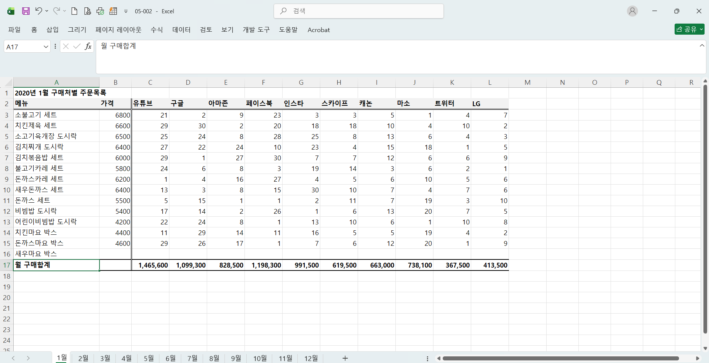

## 05-2. 나만의 목록을 만들어 원하는 순서대로 정렬하기
> **데이터에서 고유 값 찾고, 사용자 지정 목록 등록하기(228 ~231p)를 진행 후 인증사진을 첨부해주세요.**
1.고유값 찾기 및 중복값 제거 : [K]열 머리글 선택후 [M]열에 복사, 데이터-데이터 도구 -중복된 항목 제거 -> 원하는 정렬 순서에 따라 재배치(TIP: 순서를 재배치할 떄 셀을 선택한 후 SHIFT를 누른 채 선택한 셀의 테두리 부분 클릭하여 원하는 위치로 드래그)
2. 사용자 지정 목록 등록
파일-옵션-고급-사용자 지정 목록 편집
3. 사용자 지정 목록으로 정렬
[K]열의 임의의 셀 선택 -> 데이터 - 정렬 및 필터 -정렬 -정렬방법: 사용자 지정 목록
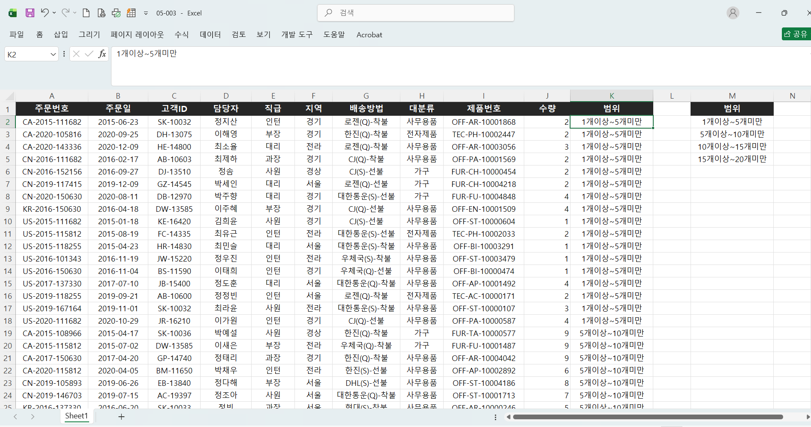

## 05-3. 조건에 맞는 데이터만 확인하는 자동 필터
> **자동 필터에서 조건 지정하여 필터링하기(235 ~236p)를 진행 후 인증사진을 첨부해주세요.**
해당 필드 선택 - 필터 - [텍스트/숫자 필터] 선택 후 조건 지정
*CTRL+SHIFT+L 2번 눌러서 자동필터 해제한 후 다시 실행 가능
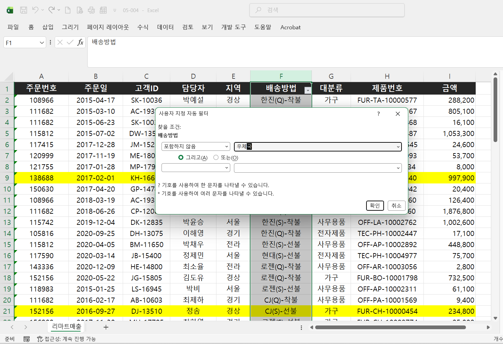
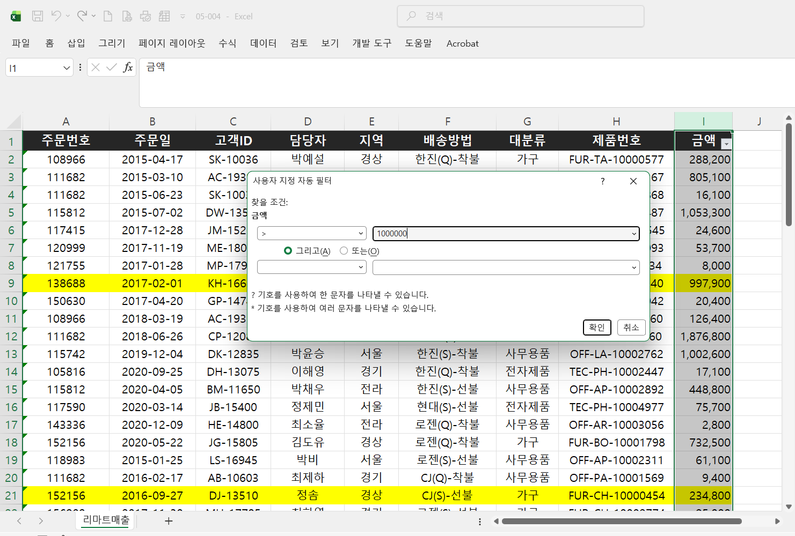

## 05-4. 자동 필터와 정렬 기능으로 판매 현황 보고서 만들기
> **매출이익률이 10% 이상인 데이터 필터링(243 ~245p)를 진행 후 인증사진을 첨부해주세요.**
매출이익률=매출이익/매출
홈-표시형식-%[백분율 스타일]지정
매출이익률 필드 선택 - 홈 -스타일 -조건부 서식- 아이콘 집합- 기타규칙
자동필터 적용: CTRL+SHIFT+L혹은 [필터]눌러 자동필터 적용 -> 숫자 필터 -> 크거나 같음 -> 10% 입력
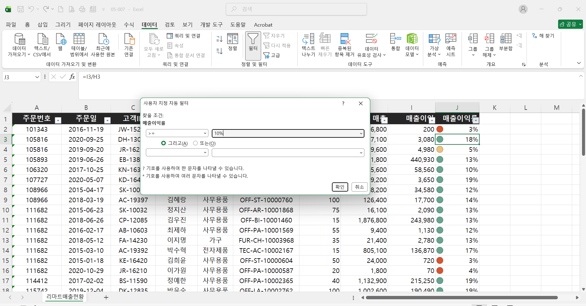

> **매출이익 Top 10 필터링 후 시각화하기(246 ~247p)를 진행 후 인증사진을 첨부해주세요.**
매출이익 필드 - 필터 - 숫자필터 - 상위 10
매출이익 필드 - 필터 - 숫자 내림차순 정렬
매출이익 머리글 클릭 - 홈 -스타일 - 조건부 서식 - 데이터 막대
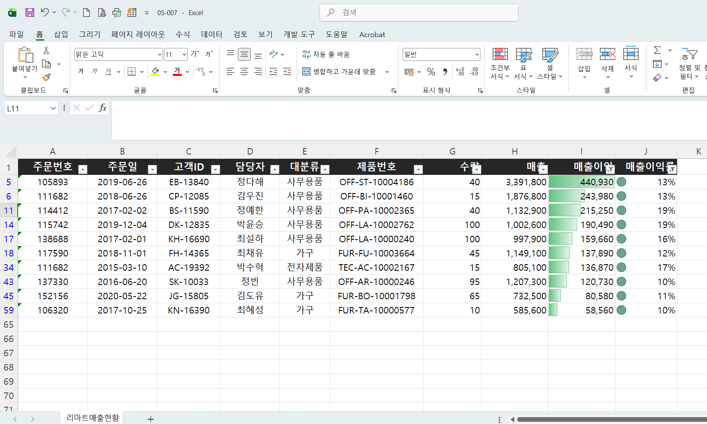

## 05-6. 원본 데이터는 유지하고, 다양한 조건을 지정하는 고급 필터
> **여러 고객사 목록을 한방에 필터링하기(251 ~254p)를 진행 후 인증사진을 첨부해주세요.**
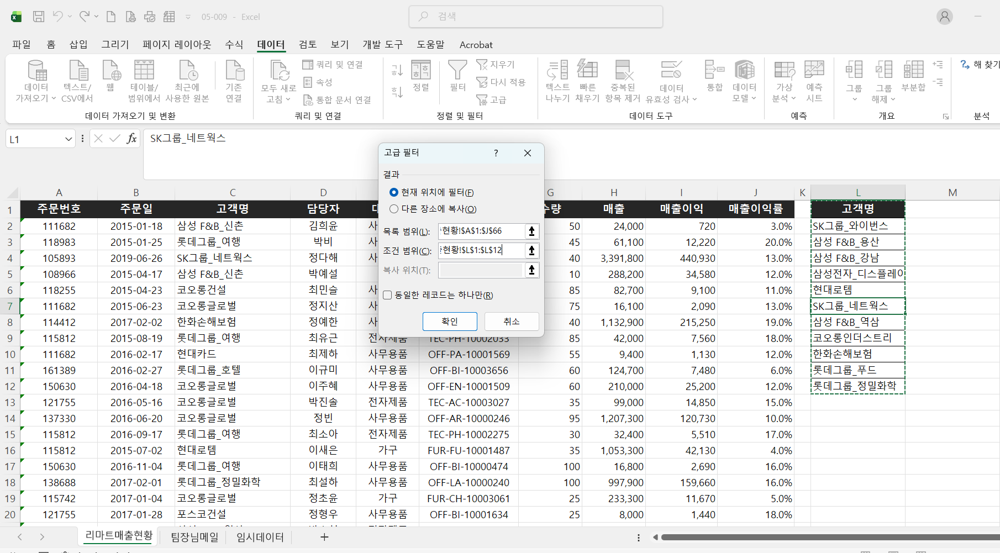

> **AND, OR 조건으로 고급 필터 실행하기(254 ~257p)를 진행 후 인증사진을 첨부해주세요.**
## AND 조건 필터링
조건을 같은 행에 입력, 지정한 모든 조건에 만족하는 값을 필터링
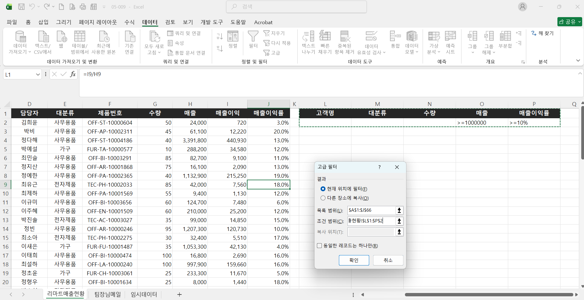
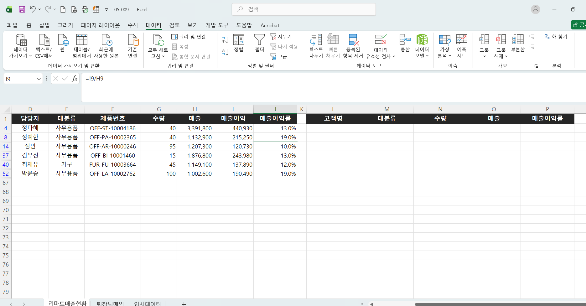
## OR 조건 필터링
조건을 서로 다른 행에 입력, 조건 중 한 가지라도 만족하는 값을 필터링
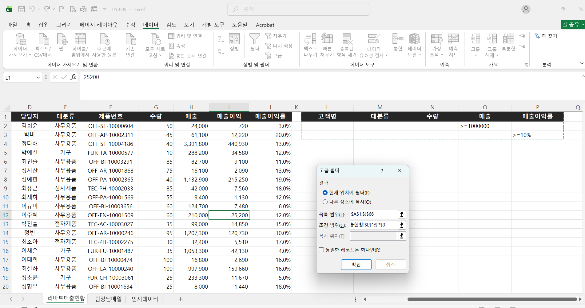
## AND, OR 조건 동시 사용
사무용품이면서 100개이상이거나 가구이면서 80개이상인 데이터 필터링
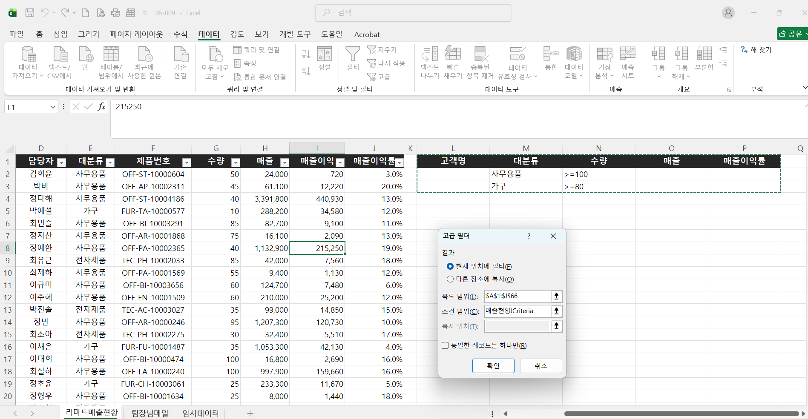
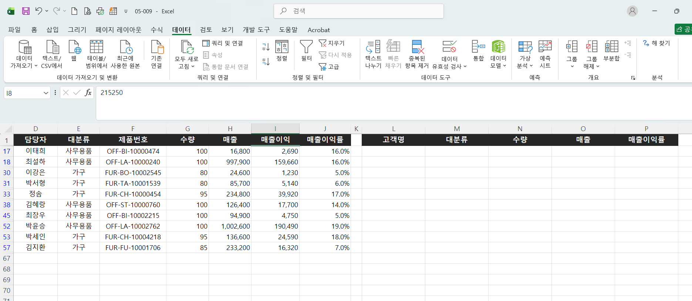

> **원본과 다른 시트에 필터링 결과 추출하기(258 ~260p)를 진행 후 인증사진을 첨부해주세요.**
추출시트- 데이터 - 정렬 및 필터 - 고급 -[결과]옵션을 다른 장소에 복사로 설정
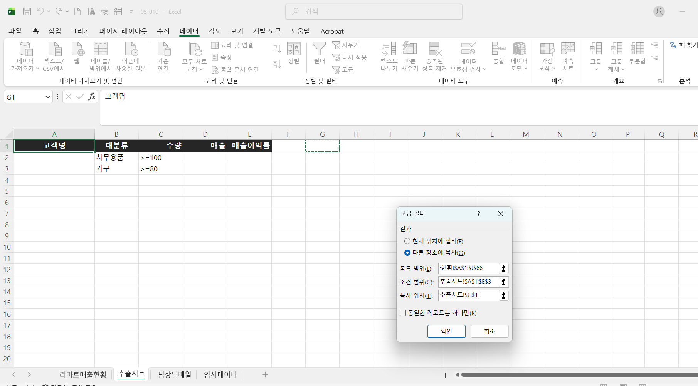
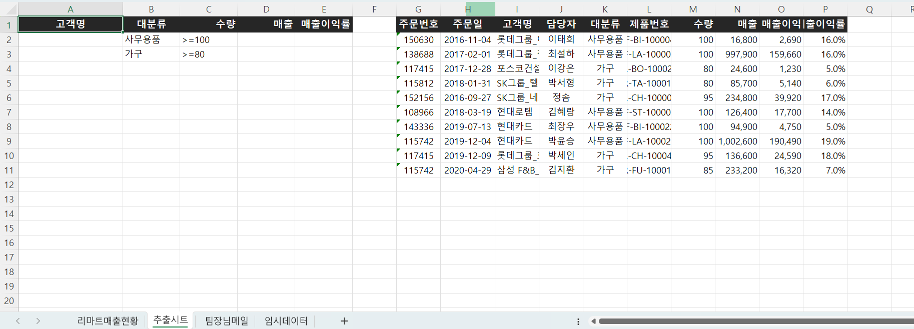

---

### 🎉 수고하셨습니다.

