# Excel 5주차 정규 과제 

📌Excel 정규과제는 매주 정해진 분량의 『*진짜 쓰는 실무 엑셀*』 을 읽고 학습하는 것입니다. 이번주는 아래의 **EXCEL_5th_TIL**에 나열된 분량을 읽고 공부하시면 됩니다.

아래의 문제를 풀어보며 학습 내용을 점검하세요. 문제를 해결하는 과정에서 개념을 스스로 정리하고, 필요한 경우 제시된 강의를 참고하여 보완하는 것이 좋습니다.

**교재 실습 예제 파일은 1주차 과제 설명 노션에 있습니다. 해당 파일을 다운 후 실습 진행해주시면 됩니다.**

**👀(수행 인증샷은 필수입니다.)** 

## EXCEL_5th_TIL

### 6장 데이터 자동화 및 분석을 위한 표 & 피벗 레이블
#### 01. 범위가 자동으로 확장되는 엑셀 표 기능
#### 02. 원하는 형태로 재정렬한 피벗 테이블 만들기
#### 03. 피벗 테이블의 값 표시 형식 파악하기
#### 04. 데이터를 빠르게 집계하는 그룹 및 정렬 기능
#### 05. 피벗 테이블의 활용도를 높여 줄 유용한 기능
#### 06. 실시간 데이터 분석을 위한 슬라이서, 시간 표시 막대

## Study Schedule

| 주차  | 공부 범위     | 완료 여부 |
| ----- | ------------- | --------- |
| 1주차 | p.22~111    | ✅         |
| 2주차 | p.112~157   | ✅         |
| 3주차 | p.158~213  | ✅         |
| 4주차 | p.214~273 | ✅         |
| 5주차 | p.274~339 | ✅         |
| 6주차 | p.340~425 | 🍽️         |
| 7주차 | p.426~472 | 🍽️         |

 

<!-- 여기까진 그대로 둬 주세요-->

---

# 1️⃣ 학습 내용 정리

## 06-1. 범위가 자동으로 확장되는 엑셀 표 기능
> **범위를 표로 변경하고 이름 지정하기(274 ~276p)를 진행 후 인증사진을 첨부해주세요.**
범위를 표로 변경하기 위해,
 데이터가 입력된 범위에서 임의의 셀을 선택한 후 삽입-표 그룹에서 [표]를 클릭하거나 ctrl+T를 눌러 '표 만들기' 대화상자를 열어 범위가 자동으로 지정된 것 확인하고, [머리글 포함]에 체크한 후 확인 버튼 클릭
* 선택한 셀이 연속된 범위이면 표로 변경할 범위를 자동으로 인식하지만 연속되지 않은 범위를 표로 변환한다면, 직접 범위를 지정해야 함.
* 범위를 표로 변경할 때는 첫 행에 머리글을 입력하는 것이 좋음.
* 표 쉽게 사용하기 위해, [테이블 디자인]-[속성]-[표 이름] 입력
* 표 아래에 새로운 데이터 추가 시 자동으로 표가 확장됨.
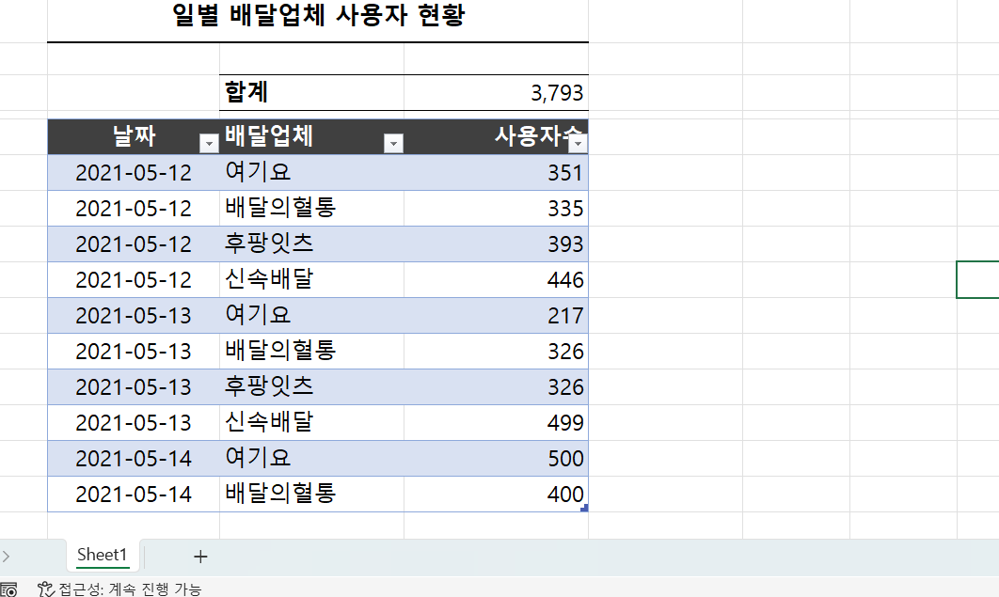

## 06-2. 원하는 형태로 재정렬한 피벗 테이블 만들기
> **피벗 테이블 레이아웃 변경 및 꾸미기(289 ~294p)를 진행 후 인증사진을 첨부해주세요.**
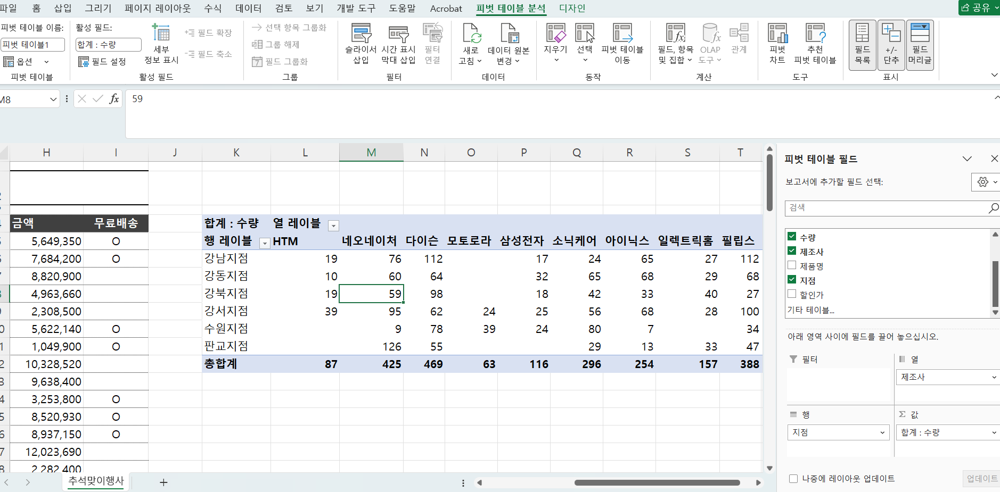
압축 형식의 보고서 레이아웃: 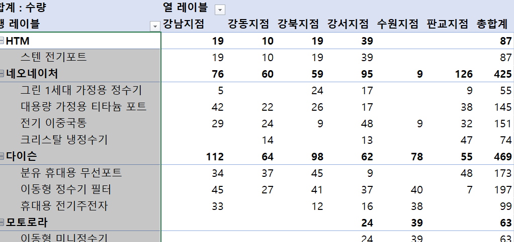
테이블 형식의 보고서 레이아웃: 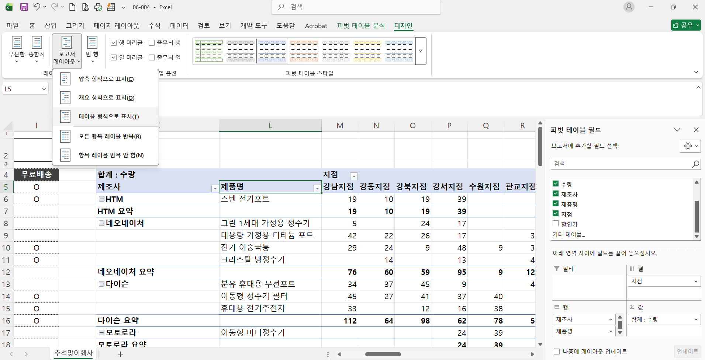
*피벗 테이블의 레이아웃 설정
-피벗 테이블의 기본 보고서 레이아웃: 압축 형식
 장점: 하나의 열에 많은 양의 정보를 담을 수 있음.
 단점: 함수를 사용하여 데이터를 분석하거나 깔끔한 보고서를 만들기 어려움.
 --> 실무에서는 데이터 분석에 용이한 '테이블 형식'을 사용하는 것이 대부분의 상황에서 효과적임.
 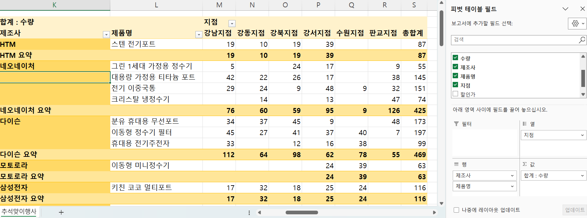
 * '피벗 테이블 옵션' [표시]탭에서 [확장/축소 단추 표시]옵션을 체크 해제하면 깔끔한 보고서 완성 가능
 --> 이 경우 여러 필드 배치한 영역에 커서를 놓고 shift를 누른 채 마우스 휠을 위/아래로 조절해서 필드 영역을 일괄 확장/축소 가능
 * 피벗 테이블 옵션에서 [레이아웃 및 서식]탭에서 업데이트 시열 자동 맞춤 옵션을 체크 해제하여 피벗 테이블의 열 너비를 항상 고정시킬 수 있음.
 
> **필드 표시 형식 및 집계 방식 변경하여 매출 현황 분석하기(294 ~298p)를 진행 후 인증사진을 첨부해주세요.**
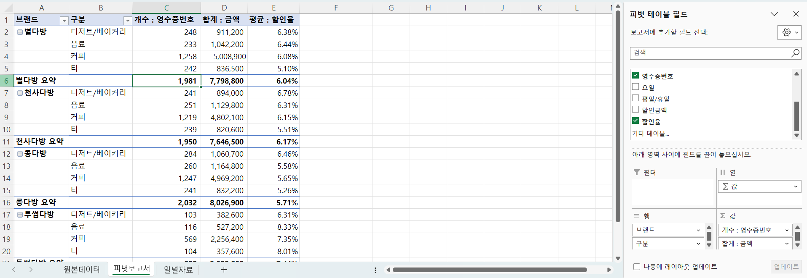
* 가독성 있게 필드 표시 형식 변경
    [필드 표시 형식]- 숫자- 1000단위 구분기호 사용
    전체 열 선택 - [셀 서식]- 백분율 - 소수 2번째 자리까지 표시
* 데이터 해석의 오류가 발생할 수 있는 집계 방식 선택
-피벗 테이블에서 합계와 평균으로 데이터를 집계할 때는 명확한 기준에 따라 집계 방식을 선택해야함.
    평일의 매출과 휴일의 매출을 비교할때, 평일은 5일/휴일은 2일이므로 평일 매출 합계가 휴일 매출 합계보다 많은 것은 당연함. 이 경우 합계가 아닌 평일/휴일별 매출 '평균'을 사용해야함. 
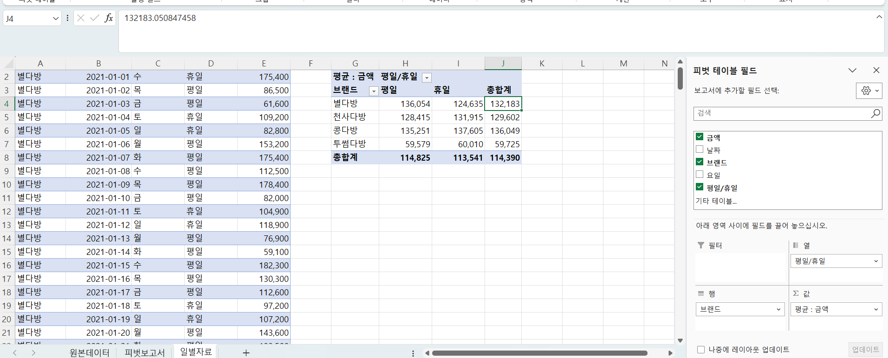
    위와 비슷한 상황으로, 월별 매출을 비교할 때 
    월에 따라 한달이 28일이거나 30일 혹은 31일이므로 정확한 월별 매출을 비교할 때도 평균으로 집계하는 것이 좋음.

## 06-3. 피벗 테이블의 값 표시 형식 파악하기
> **조건부 서식과 값 표시 형식으로 입고 내역 분석하기(300 ~304p)를 진행 후 인증사진을 첨부해주세요.**
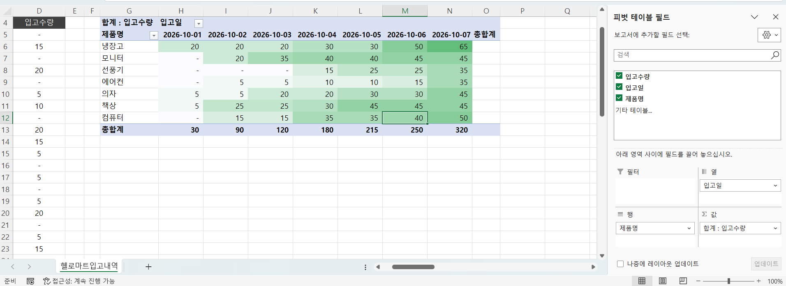
* 각 재고의 일별 입고 내역의 누계 파악을 위해,
임의 입고 수량값에서 마우스 우클릭 -[값 표시 형식]-[누계] 선택 - [기준필드]옵션은 입고일로 설정 - 확인
* 피벗 테이블이 원본 데이터의 변경에 따라 확장/축소 되듯 조건부 서식도 피벗 테이블 변경에 따라 맞게 적용될 수 있도록 설정이 필요하다.
조건부 서식 지정 시 [조건부 서식]-[규칙관리]-적용한 조건부 서식 선택 후 [규칙편집]을 클릭하여 규칙 적용 대상을 성정한다.
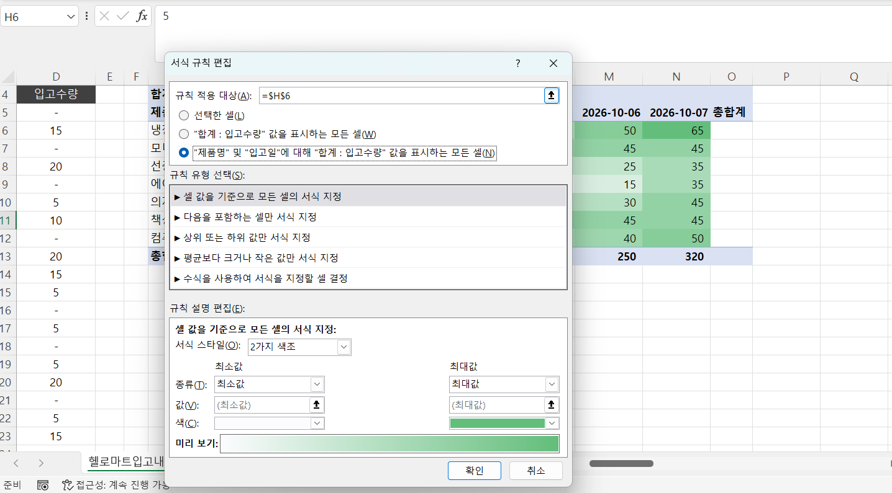
<주 단위로 매출 변화량 분석하기>
[값 표시 형식]-[[기준값]과의 차이]-기준필드 옵션으로 '주번호', 기준항목 옵션으로 '이전'으로 설정하면 한 주 전을 기준으로 매출 변화량을 확인할 수 있음.
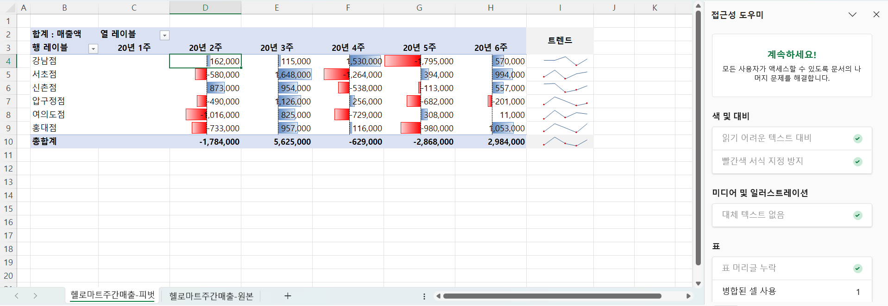

> **값 표시 형식으로 입고 수량의 합계와 비율 표시하기(305 ~306p)를 진행 후 인증사진을 첨부해주세요.**
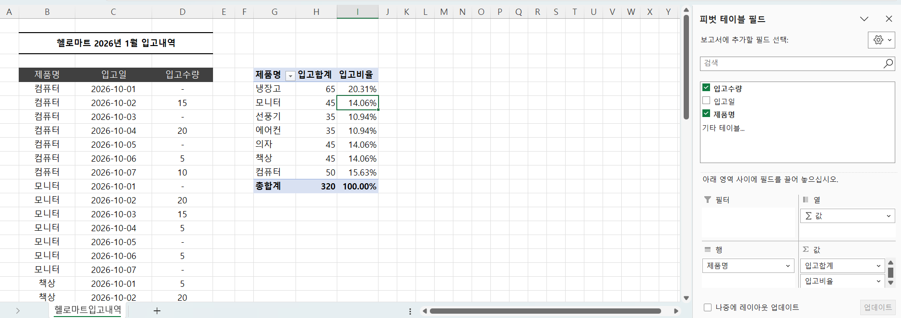
행-제품명 필드
값-입고수량 필드 
   입고수량 필드 2 --> 값 표시 형식: 총합계 비율

## 06-4. 데이터를 빠르게 집계하는 그룹 및 정렬 기능
> **그룹 기능으로 구간별 데이터 분석하기(307 ~309p)를 진행 후 인증사진을 첨부해주세요.**
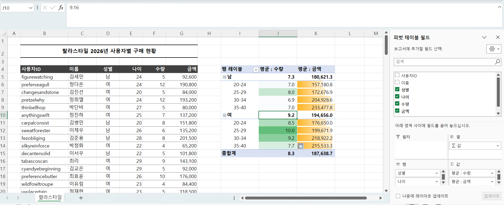
피벗 테이블의 '그룹'기능은 나이나 금액처럼 숫자형식의 데이터가 넓은 범위로 흩어져서 입력되어 있을 때 지정한 구간별로 묶어서 분석 가능
* 그룹 기능은 필드 값에 텍스트가 하나도 포함되어 있지 않은 숫자일 때만 사용가능

> **날짜 데이터 그룹화 및 일주일 단위로 구분하기(310 ~312p)를 진행 후 인증사진을 첨부해주세요.**
날짜 데이터 그룹화:
1. 연도/월 별 그룹화
월 필드 이외에 자동으로 인덱싱된 그룹을 추가하기 위해 월 항목 [마우스 우클릭]후  [그룹]-월,연 선택 -> 날짜가 연도/월 단위로 집계됨.
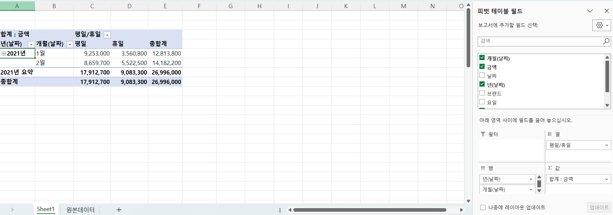
2. 특정 일자(3일)기준 그룹화
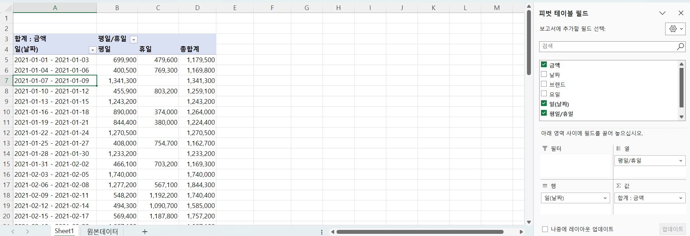
3. 주 단위별 그룹화
[그룹]-시작 날짜 선택 - 목록에서 [일] 선택 - 날짜 수에 7일 입력하면 매주 월요일부터 일주일 단위로 그룹화됨.

> **필터 및 정렬 기능으로 우수 고객 빠르게 파악하기(313 ~316p)를 진행 후 인증사진을 첨부해주세요.**
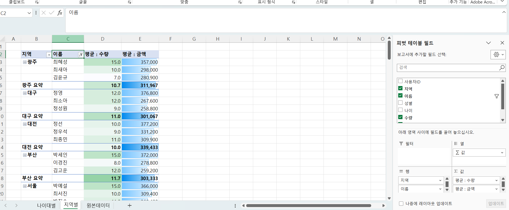
피벗 테이블 필드에서 필터 사용 시 문제점: 피벗 테이블 보고서에 필터링된 항목이 표시되지 않음.
-> 따라서 해당 필드를 [행]영역에 배치한 후 [레이블 필터]를 이용하는 것이 좋음.
(이 경우, 보고서 레이아웃-테이블 형식으로 표시로 세팅해놓기)
지역별 우수 고객 선발 --> [이름]필드의 필터 버튼 클릭 - 값 필터 - 상위 10 - <상위,3,항목,평균:금액>으로 설정 - 확인

## 06-5. 피벗 테이블의 활용도를 높여 줄 유용한 기능
> **계산 필드로 매출이익률 구하고 #DIV/O! 오류 해결하기(320 ~322p)를 진행 후 인증사진을 첨부해주세요.**
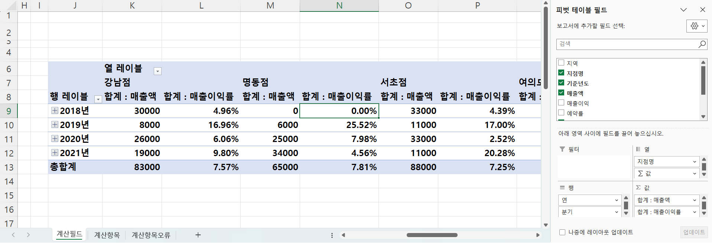
* 계산필드로 매출이익 구하기
피벗테이블 분석 - 계산 그룹 - 필드 항목 및 집합 - 계산필드 - 계산필드 삽입 대화상자 < 이름:매출이익률 /수식: 매출이익 / 매출액> 입력 후 확인
* #DIV/O! 오류 해결하기
마우스 우클릭 - 피벗 테이블 옵션 - 레이아웃 및 서식 탭 - 오류 값 표시 체크 후 0입력

> **계산 항목으로 행과 열의 항목 간 계산된 값 추가하기(322 ~325p)를 진행 후 인증사진을 첨부해주세요.**
계산 항목으로 행과 열에 표시된 각 항목을 지정하여 항목 간 계산된 값을 추가할 수 있음.
* 계산항목 주의점
-계산항목은 그룹화된 필드에서는 사용 불가
-계산항목을 올바르게 사용하려면, [행],[열] 영역에 하나의 필드만 배치해야 함.
-계산필드를 사용한 상태에서 계산 항목으로 다시 계산하면 올바르지 않게 계산될 수 있음.
피벗 테이블 분석 - 계산 - 필드,항목 및 집합 - 계산 항목 (*계산 항목은 피벗 테이블의 행 또는 열 영역을 선택했을 때만 활성화 됨) -> 오류 -> 그룹 해제 후 계산 항목 사용
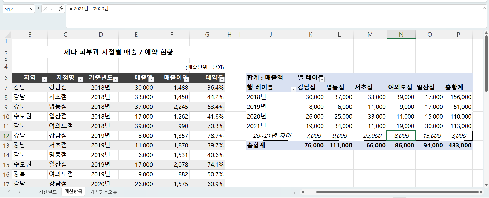

## 06-6. 실시간 데이터 분석을 위한 슬라이서, 시간 표시 막대
> **피벗 레이블의 최강 콤비, 슬라이서 추가하기(326 ~329p)를 진행 후 인증사진을 첨부해주세요.**
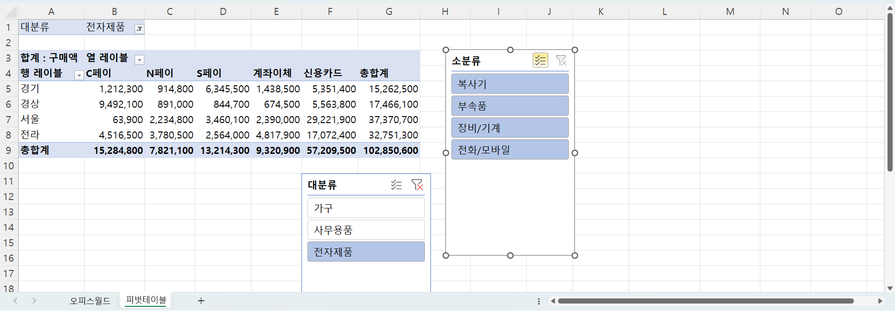
슬라이서 = 피벗 테이블 필터링 도구

> **시간 표시 막대와 슬라이서로 날짜 필터링하기(329 ~332p)를 진행 후 인증사진을 첨부해주세요.**
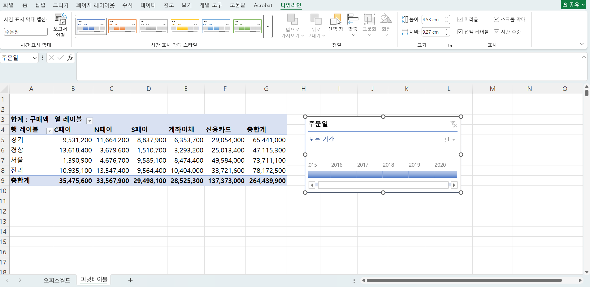

연속된 기간 필터링:
피벗테이블 분석- 필터- 시간 표시 막대
연속되지 않은 기간 필터링: 
슬라이서 사용
피벗테이블 필드 패널에서 주문일 필드를 행 영역의 지역 필드 아래로 드래그
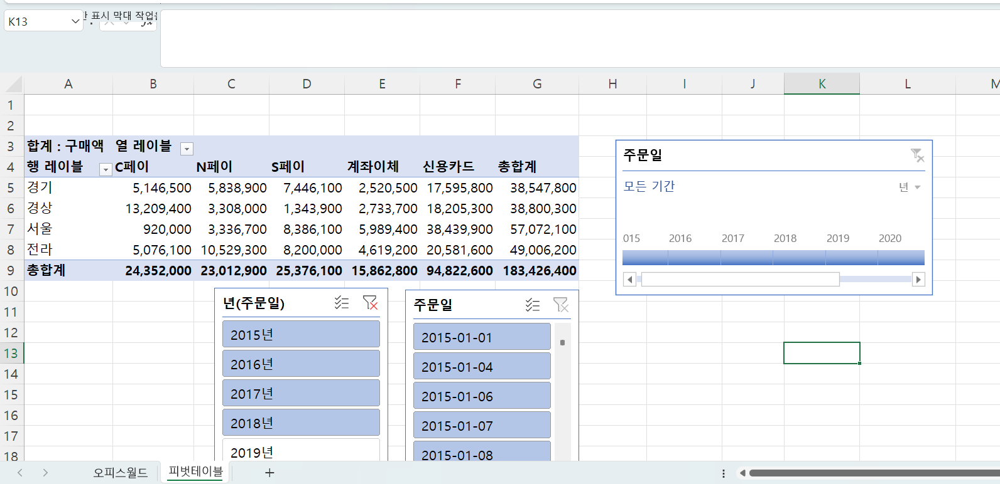

> **대시보드 제작을 위한 슬라이서 꾸미기(333 ~335p)를 진행 후 인증사진을 첨부해주세요.**
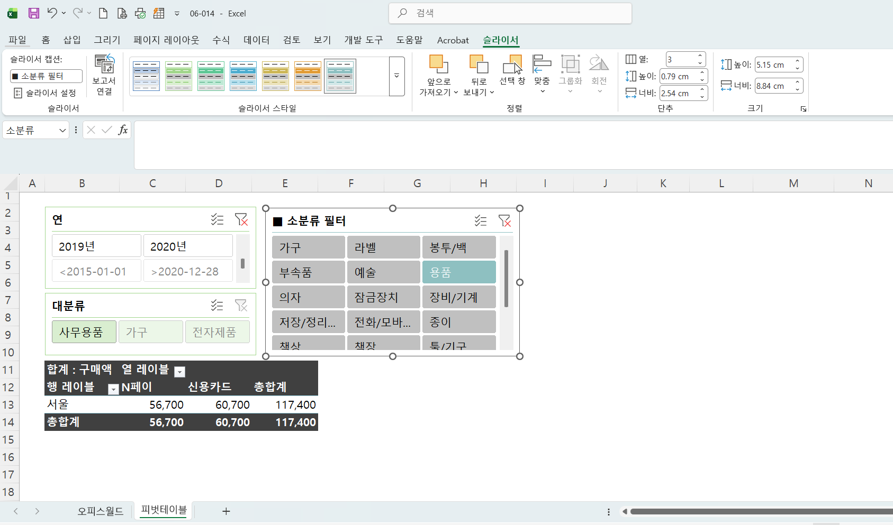
페이지 레이아웃-테마
:통합문서 내 모든 시트의 개체의 서식 일괄 변경
슬라이서-슬라이서 스타일
: 기본으로 제공하는 스타일 중 일부 디자인을 변경해서 사용하고 싶다면 스타일 목록 중 원하는 디자인과 가장 유사한 스타일을 찾아 [마우스 우클릭]후 [중복]

> **여러 피벗 테이블을 동시에 필터링하기(336 ~338p)를 진행 후 인증사진을 첨부해주세요.**
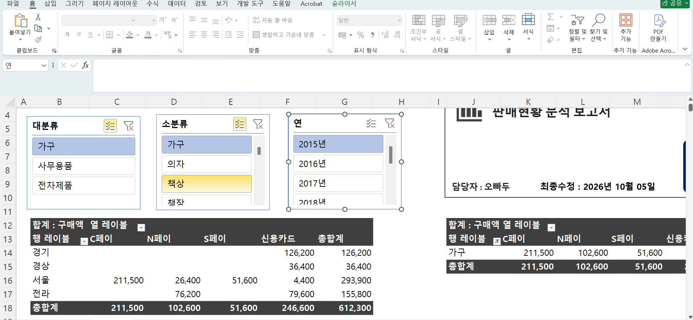
피벗테이블 분석- 필터 그룹- 슬라이서 삽입(대분류,소분류, 연)
각 슬라이서 마우스 우클릭 후 보고서 연결 클릭 - 연결할 2개의 피벗 테이블(소분류 매출, 지역별 매출)에 모두 체크

---

### 🎉 수고하셨습니다.

